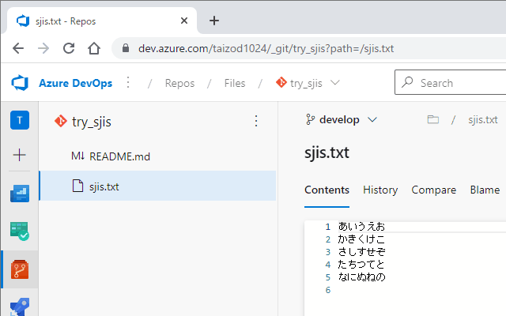

# Chrome Extension for Azure Repos SJIS files

Azure Repos の Web サイトで SJIS ファイルを表示するための拡張機能です。

- Azure Repos の Web サイトは UTF-8 以外のファイルを適切に表示できません。コミットされているファイルのエンコーディングに関わらず Windows-1252 として処理しているため、UTF-8以外のファイルは文字化けが生じます。

- 本拡張機能は SJIS ファイルの文字化けを訂正して適切に表示します。

#### 通常の SJIS ファイルの表示

#### 本拡張機能適用後の SJIS ファイルの表示

#### 開発手順

- 開発
  - `./src` 更新
- テスト
  - `chrome://extensions` で「パッケージ化されていない拡張機能を読み込む」
- ドキュメント
  - `./README.md`更新
  - `./extension/manifest.json` の `version` プロパティを修正
- リリース
  - [chrome web store](https://chrome.google.com/webstore/category/extensionschrome) ≫ developer dashboard
