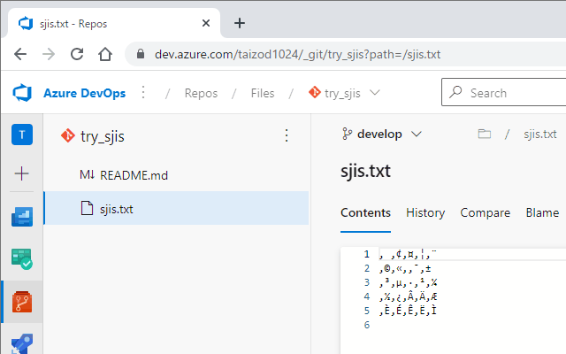

# Chrome Extension for Azure Repos SJIS files

This extension supports displaying SJIS files in Azure Repos website.

The Azure Repos website only supports displaying in UTF-8. Therefore, SJIS files are normally not displayed properly. This extension corrects the display of SJIS files.

### before

#### after

